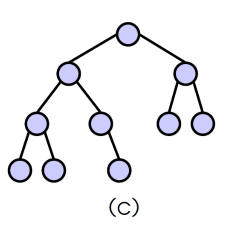

# Alberi binari

Un albero binario è:

- Un albero vuoto
- Una tripla(left,elem, right)

Dove:

- left e right sono alberi. Sono detti sottoalberi destri e sinistri
- elem è l'elemento che è detto radice


Ad esempio prendendo il primo 27, abbiamo left 13 e right l'albero che parte da 42.

Definizioni:

- La radice di left è il figlio sinistro
- La radice di right è il figlio destro
- I figli di elem sono detti fratelli
- Un elemento senza figli è detto foglia
- Un elemento è internmo se non ha nè radici nè foglia.

L'albero è una struttura ricorsiva.

Da ciò ricaviamo che gli alberi saranno rappresentato da:
```c
struct treeNode {
    Tree left;
    T data;
    Tree right;
};
```

Concretamente un albero binario sarà rappresentato come:

- Un albero vuoto = NULL
- Un puntatore a struct treeNode

## Definizioni

### Cammino

Un cammino da un nodo n ad un altro nodo m è una sequenza di nodi connessi da archi che
portano da n ad m.

Sia n un nodo e T un albero binario:

- Un qualsiasi nodo m che è lungo il cammino tra la radice r e n si dice **antenato**
- Se m è antenato di n, allora n è discendente di m. Se m è diverso da n allora m è antenato proprio di n. n è discendente proprio di m.

### Profondità di un nodo

La profondità è la lunghezza del cammino dalla radice r e un nodo m. Cioè quanti archi ci sono tra r e m.

L'altezza di un albero è la profondità del nodo di profondità massima. L'albero vuoto ha altezza -1.


### Grado di un nodo

Il grado di un nodo è il numero di figli di quel nodo.

Un albero binario è completo se:

- Tutte le foglie hanno la stessa profondità
- Tutti i nodi interni hanno grado 2

Un albero è pseudo quasi completo se tutti i livello tranne l'ultimo sono completo.



Un albero è quasi completo se le eventuali foglie mancanti nell'ultimo livello sono consecutive a partire dall'ultima a destra. Cioè nell'ultimo livello le foglie sono tutte a sinistra.


### Alberi binari degeneri e completamente sbilanciati

Un albero binario è degenere se ogni nodo ha al più un figlio.

Un albero binario è completamente sbilanciato a sinistra se ogni nodo ha al più un figlio sinistro.

Un albero binario è completamente sbilanciato a destra se ogni nodo ha al più un figlio destro.

## Proprietà degli alberi binari

Un albero binario completo di altezza h, ha esattamente 2^{h+1}-1 nodi.

Un albero binario completo di altezza h, ha $2^{h}$ foglie.

Sia T un albero binario quasi completo di altezza h, allora $2^{h} \leq nodi(T) \leq 2^{h+1}-1$

L'altezza di un albero binario quasi completo con n nodi è $h=log(h)$

# Alberi di ricerca binario(ARB)

Un albero di ricerca binario T è un albero binario tale che:

- Gli elementi appartengono ad un elemento totalmente ordinato rispetto a $\leq$
- $\forall k \in T$:
    - Tutti gli elementi del sottoalbero sinistro di $k$ sono $\leq k$
    - Tutti gli elementi del sottoalbero destro di $k$ sono $\geq k$


## Principio di induzione strutturale sugli alberi binari

Se una proprietà vale per l'albero vuoto(caso base) e assumendo che valga per left e right allora se riusciamo a dimostrare che vale anche per $<elem, left, right>$, allora vale per qualsiasi albero binario

## Algoritmi di visita di un ARB

Algoritmi ricorsivi:

### in-order

Visita prima il sottoalbero sinistro, poi la radice e infine il sottoalbero destro. Cioè visita gli elementi in ordine.

### pre-order

Visita la radice, visita il sottoalbero sinistro e poi quello destro

### post-order

Visita il sottoalbero sinistro, poi quello destro e infine la radice

Il caso base per la ricorsione su alberi binari è:

```
if(tree == NULL){
	// Caso base. Ad esempio return 0
} else {
	// Caso induttivo. Richiamo la funzione ricorsivamente in base all'ordine. Ad esempio func(tree->left); printf("%d\n", tree->data);func(tree->right); per iterare sinistra-radice-destra 
}
```

Algoritmi iterativi:

### Visita in ampiezza

Visita l'albero per livelli:

- Visito la radice
- Visito i nodi di ciascun livello da sinistra a destra


Visito 27, poi 13 e 42. Poi 6-17 e 33-48.

Si implementa usando una coda.

Non può essere fatto in modo ricorsivo perchè non rispetta l'induzione sugli alberi.

### Visita in profondità(o pre-order)

Usa la pila perchè dovremo tenere traccia dei nodi da visitare.

Una volta che abbiamo costruito la pila. possiamo visitare i nodi direttamente da lì.

Visita come la vista pre-order(radice, sottoalbero sinistro e sottoalbero destro)
