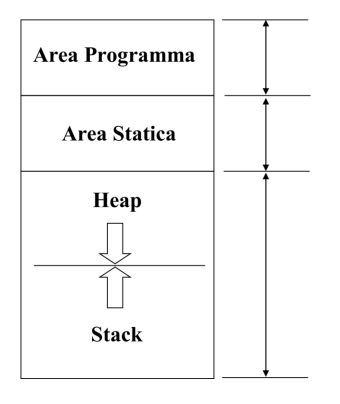

# Variabili locali con qualificatore static

Una variabile locale static è una variabile che mantiene il suo valore anche dopo che la funzione è terminata.

```c
int nextNumber() {
    static int counter = 1;
    return counter++;
}
```

In questo caso counter aumenterebbe ogni volta.

# Variabili globali e qualificatori extern e static

Una variabile globale è definita fuori da una funzione. Tutte le funzioni definite dopo la variabile, ne possono accedere.

Il qualificatore `extern` permette di importare variabili globali in altri file o programmi. Può anche essere usata per usare le variabili anche se sono definite più avanti nel codice.

Il qualificatore `static` permette di usare la variabile globale a tutte le funzioni definite dopo la variabile globale e non è disponibile per essere importata in altri file.

Nella dichiarazione delle variabili è implicito `extern`.

# Organizzazione della memoria in C

## Tipi di memoria in C

### Area del programma

Memorizza il programma compilato e linkato. La dimensione è fissata a compile time.

### Memoria statica

Usata per le variabili `static` e per le variabili globali. La dimensione è fissata a compile time.

### Memoria dinamica(heap)

Usata per allocare variabili la cui dimensione si conesce solo a runtime.

L'uso di questo tipo di memoria è controllata esplicitamente dal programmatore attraverso le funzioni:

- `malloc()` che alloca memoria nell'heap e ritorna il puntatore al primo byte allocato. Ritorna NULL se fallisce. Dobbiamo sempre controllare che non ritorni NULL cioè l'allocazione fallita
- `free()` Libero lo spazio allocato da una `malloc()`

Ricordiamoci che quando usiamo la `free()` il puntatore non può più essere usato e magari è stato allocato da un'altra `malloc()` per evitare situazioni di dangling pointer(puntatore non allocato che non è stato tolto dal programma e c'è il rischio che venga usato anche se non è allocato).

La malloc crea una tabella che associa ad un indirizzo la variabile allocata a quel blocco.

Quando viene chiamata la `free()` viene dissociata.

### Memoria automatica(stack)

Usata per memorizzare i record di attivazione delle funzioni.

Ogni record di attivazione è costituito da:
1. L’indirizzo di codice dell’istruzione successiva a quella che ha invocato la funzione (indirizzo di rientro);
2. I parametri della funzione
3. Le variabili locali (non static) alla funzione.



# Dichiarazione automatica

Variabili che viene messa nello stack. Sono variabili dichiarate come: 

```c
int a = 10;
// Oppure
static int a = 10;  // In questo caso viene salvata nella memoria statica
```

Il tipo identifica quanti byte e come sono organizzati per quel tipo di variabile.
L'indirizzo identifica la porzione di memoria occupata dalla variabile
Il valore è il contenuto della memoria.

## Assegnazioni

```c
int a = 10;
a = a+1;
```

A sinistra abbiamo il left-value(L-VALUE) che è l'indirizzo dove scrivere il nuovo valore.
A destra abbiamo il right-value(R-VALUE) che è il valore che verrà scritto nella memoria.

La memoria viene allocata nella memoria statica(static) o nello stack.

# Allocazione dinamica

```c
#include <stdlib.h>
void *malloc(size_t size);
void free(void *ptr);
```

Esempio di malloc:

```c
#include <stdlib.h>
int *ptr = (int *)malloc(size_t size);
// CODICE
free(ptr);
```

Il valore `int *ptr` indica solo l'indirizzo nell'heap e viene allocato nello stack. La malloc poi allocarà lo spazio nella heap ed occupa sempre 8 byte(lunghezza dell'indirizzo).

# Confronto allocazione dinamica vs statica


## Deallocazione di un puntatore

```c

char *d = (char *) malloc(sizeof(char)*10);
free(d);
d = NULL;   // Bisogna sempre mettere a NULL il puntatore per evitare accessi sbagliati ad aree di memoria non allocate
if (d != NULL) {
    printf("%i", d[0]);
}
```

Quando facciamo una `free()` la memoria viene liberata e può essere riutilizzata dalla `malloc()`

```c
void init(int aparam[]) {
    for (int i=0; i<N; i++)
        aparam[i]=i+10;
} 
```

In questo caso una funzione del genere, accetta tipi `int *` e `int []`

## Allocazione dinamica di struct

```c
typedef struct libro Libro;
Libro * l;
l = (Libro *) malloc(sizeof(Libro);
```

La free funziona in modo analogo.

Rappresentazione in memoria astratta: Strutture senza padding e dimensione delle variabili "vera".

