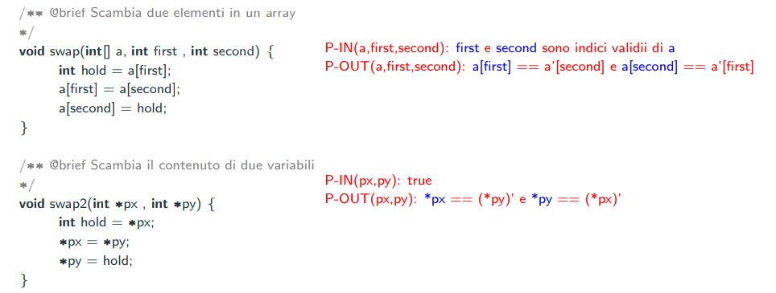

# Correttezza formale di un programma

## Correttezza parziale

Data una funzione, scriviamo in logica del primo ordine le condizioni di ingresso(predicato di ingresso/input) e le condizioni di uscita(predicato di output).

```c
/** @brief Dato l’input x 1,...,x n (n >= 0) restituisce l’output z
* P−IN(x 1,...,x n): una condizione su x 1,...,x n (detta ‘‘predicato di input’’)
* P−OUT(x 1,...,x n,z): una condizione su x1,...,x n e z (detta ‘‘predicato di output’’)
*/
t prog(t 1 x 1, ..., t n x n) {
/* CORPO DELLA FUNZIONE */
}
```

**Un programma è parzialmente corretto se per tutti i valori per cui vale il predicato di ingresso e l'esecuzione termina, allora vale il predicato di output sul ritorno della funzione.**

**Un programma è terminante rispetto al predicato di input, se per tutti i valori di ingresso per cui vale il predicato d'ingresso, allora l'esecuzione della funzione termina.**

Se la funzione è corretta allora è parziamente corretta e terminante.

Esistono due metodologie per verificare la correttezza di un programma:

- Post-hoc Verification(PhV), prima scrivo il programma poi lo verifico
- Correctness by construction(CbC), sviluppo il programma per raffinamenti successivi rispetto alla pre-condizione e post-condizione

## Caratteristiche CbC e PhV

Sono:

- Formale e precisa, scritto in logica
- Intensionale, descrive input e output
- Completa
- Significativa, deve descrivere una relazione importante
- Verificabile in modo semi automatica
- In evoluzione, se il codice evolve, evolve la specifica

## Invarianti di ciclo

Tecnica CbC per costruire correttamente programmi iterativi. Viene anche detta metodologia di sviluppo guidata dall'invariante di ciclo.

Per costruire un ciclo correttamente bisogna:

- Pensare al passo generico del ciclo. Questo passo generale viene detto **invariante** e scrivere il corpo del ciclo
- Scrivere la condizione del ciclo
- Inizializzare le variabili

L'invariante va usato in caso di scrittura di cicli non banali.

#### Esempio

Cerchiamo il massimo in un array:

Per primo scriviamo l'assunzione cioè il predicato di ingresso e poi il predicato di output(il valore restituito).

```c
/* @brief 
* Assume: lunghezza(a) >= n >= 1.
* Restituisce:
* − il massimo elemento che occorre nella porzione di array a[0..n−1].
*/
int maximum(const int[] a, int n) {

};

```

Poi scriviamo una suite di test case.

Successivamente scriviamo un template del corpo del programma che ci avvicina alla soluzione.

```c
/* @brief Assume: lunghezza(a) >= n >= 1.
* Restituisce:
* − il massimo elemento che occorre nella porzione di array a[0..n−1].
*/
int maximum(const int[] a, int n) {
int max = /* VALORE INIZIALE */
// I.C.: max e’ il massimo in a[0..i−1]
for (int i = /* INDICE INIZIALE */ ; /* CONDIZIONE */; /* INCREMENTO DELL’INDICE */) {
/* CORPO DEL CICLO */
}
return
}
```

Poi eseguiamo questi passi:

- Scrivo il corpo del ciclo
- Scrivo le condizioni del ciclo
- Ritorno il massimo

Questo sarà il codice finale:

```c
/* @brief Assume: lunghezza(a) >= n >= 1.
* Restituisce:
* − il massimo elemento che occorre nella porzione di array a[0..n−1].
*/
int maximum(const int[] a, int n) {
    int max = a[0];
    // I.C.: max e’ il massimo in a[0..i−1](vale per il primo cicli, infatti a[0] è il massimo tra a[0..i] cioè a[0..0])
    for (int i = 1; i <= n−1; i++) {
        if (max < a[i]) max = a[i];
    }
    return max;
}
```

Se il codice ha più valori di return, creiamo più P-OUT e li mettiamo in XOR:


## Notazioni invarianti

In caso di funzioni che modificano un valore passato come parametro, usiamo la seguente notazione:

- se x i è un array, allora si scrive x_i per riferirsi al valore iniziale dei suoi elementi;
- se x i è un puntatore, allora si scrive (*x_i) per riferirsi al valore iniziale di *x_i.



# Test del comportamento di una funzione

Il test del comportamente è una specifica 

- formale (è scritta in linguaggio di programmazione)
. precisa (al più quanto lo è la specifica del linguaggio in cui `è scritta)
- estensionale (descrive delle coppie <input,output>)
- incompleta (salvo casi triviali, sarà sempre incompleta)
- significativa (deve descrivere dei casi interessanti. Ad esempio stringhe vuote, caratteri speciali, numeri negativi, overflow, ...)
- verificabile in modo automatico (i test sono eseguibili)
- in evoluzione (guiderà lo sviluppo della funzione per iterazioni successive)

Esempio di test:

```c
int main(void) {
puts("BEGIN TEST stoi");
    { //IMPORTANTE: Ogni blocco codifica uno UNIT TEST isolato dagli altri
        char * s = ""; // stringa vuota(esempio di input)
        int n = stoi(s);    // Chiamo la mia funzione da testare
        if !(0 == n) {  // Controllo che l'output sia quello che mi aspetto, in caso contrario, il test è fallito
            printf("−−TEST 1 FAILED−−\n");
            printf("INPUT:%s\n", s);
            printf("EXPECTED:%d\n", 0);
            printf("RESULT:%d\n\n", n);
        }
    }
}
```


**Scrivere prima i test poi implementare la funzione(Test driven development)**

**I casi non definiti non vanno testati**

**Se correggiamo il codice, aggiungiamo il test case per l'input che abbiamo corretto**

## Regression testing

Quando estendiamo il funzionamento della funzione, aggiungiamo nuovi test

### Caratteristiche di un unit testing

Regola FIRST: 

- Veloce
- Isolato
- Ripetibile
- Verificabile
- Tempestivo

Inoltre è una specifica:

- Formale e precisa, scritta in un linguaggio
- Estensionale, deriva da coppie di valori input, output
- Incompleta, non ci sono tutti i casi possibili
- Significativa, ci sono casi particolari
- Verificabile in modo automatica
- In evoluzione, possono essere migliorati e aggiunti

## Passi del TDD

- Scrivere i test
- Correggere il codice se i test falliscono
- Fare il refactoring del codice se necessario

## Golden rules del TDD

- Non scrivere codice se non è necessario per i test case. **Scrivere prima i test poi implementare la funzione**


## Cosa i TDD garantiscono

- I TDD decidono la specifica e controllano che la funzione gli rispetti
- Correggono i bug prima della messa in produzione
- Possiamo, di conseguenza, aggiungere nuove funzionalità più facilmente evitando di introdurre bug