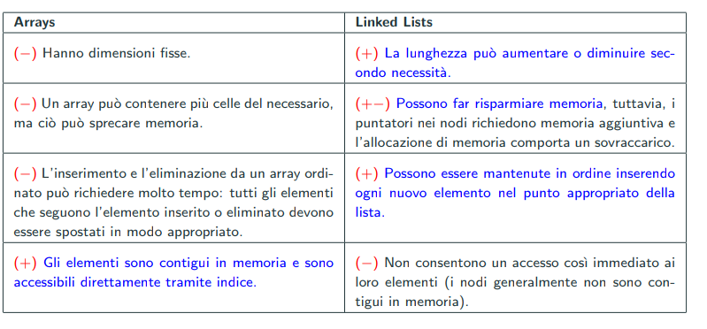

# Liste linkate

Una lista ls di elementi di tipo T è 
- Lista vuota indicata con /
- Una coppia <h, tl> dove:
    - h è un valore
    - tl è una lista

l'elemento h è detto testa(head) di ls, tl è detta coda(tail) di ls.

Concretamente:

- La lista vuota ha tl=NULL
- Una lista non vuota ha tl = struct Node

**La lista è una struttura dati ricorsiva(o autoreferenziale)**

Implementazione C(come tipo abbiamo l'int):

```c
typedef struct intListNode *IntList;
struct intListNode {
    int data;
    IntList next;
}
```

La lista vuota è rappresentata dal NULL.

data contiene il valore di quela posizione.

next è l'elemento successivo che contiene tutti gli elementi successivi.



## Operazioni sulle liste

### Visita degli elementi

La visita di una lista è un'operazione che percorre tutti i nodi di una lista.

```c
for (List currentPtr = ls; currentPtr != NULL; currentPtr = currentPtr−>next) {
/* INSERIRE QUI IL CODICE CHE VISITA IL NODO currentPtr */
}
```

Cioè facciamo un for che legge la lista successiva fino alla fine.

## Algoritmi ricorsivi

Dato che è una struttura ricorsiva, possiamo costruire operazioni ricorsive sulle liste.

### Principio d'induzione delle liste

- Caso base: La lista è vuota, cioè tl == NULL
- Caso induttivo: La lista non è vuota quindi tl != NULL

**Questo principio vale per tutte le strutture dati implementate come liste linkate**

# Pila(o stack)

Una pila è una struttura dati LIFO che implementa le seguenti operazioni:

- Creazione della pila vuota(controllando che la memoria sia disponibile(malloc != NULL). La size sarà 0)
- Distruzione della lista
- Aggiunta di un elemento in cima
- Rimozione di un elemento in cima

**La pila si può solo iterare togliendo ogni elemento dalla cima.**

Talvolta si può anche prendere il primo elemento della pila(la cima). Inoltre potrebbe avere anche dimensione fissa e questo va controllato in codice.

Si può comporre cambiando leggermente la forma della lista linkata:

```c
struct listNode {
    char data;
    ListNodePtr node;
}

struct charStack {
    ListNodePtr top;
    int size;
}
```

La pila si implementa con l'ADT in modo da non far accedere ai nodi direttamente ma implementando la pila con funzioni che svolgono il push e pop solo del primo elemento della lista.

## Pila dinamica

La pila dinamica è una pila che ha sempre una dimensione che è INITIAL_CAPACITY * 2^n, i dati non sono salvati come nodi di una lista linkata ma sono salvati in un array. Nella struttura sarà contenuto top che è l'indice alla cima dell'array(che contiene la cima della lista).

Quando facciamo un push, la dimensione ingrandisce per un fattore moltiplicativo 2^n. Per un pop diminuisce per un fattore capacity/2^n.

Quando questa lista viene allocata, allochiamo direttamente tutta la capicità INITIAL_CAPACITY * 2^n attraverso la malloc, i dati saranno salvati in un array.

Nella push, se la dimensione è grande abbastanza facciamo la push nell'array. Altrimenti dobbiamo aumentare la dimensione dell'array attraverso `realloc` per un fattore moltiplicativo 2^n.

Nella pop, se la dimensione è meno di un fattore (capacity/2^n) e la capacity > INITIAL_CAPACITY, allora rimpicciolisco la capacity. Usando questo fattore miglioriamo l'allocazione riducendo il numero di malloc nel caso di push. Infatti quando c'è ne serve metà, diminuiamo solo di 1/4 così nel caso di push ci sarà già lo spazio e non serviranno `malloc` aggiuntive.

### Implementazione

```c
struct charStack {
    int capacity; /* capacity == INITIAL CAPACITY* 2ˆn, per qualche numero naturale n >= 1 */
    char* a; /* array, di dimensione capacity, che memorizza gli elementi presenti nella pila */
    int top; /* posizione dell’elemento in cima alla pila in a (0 <= top <= capacity−1, se top = −1 allora la pila e‘ vuota) */
    /* Gli elementi della pila sono in: a[0..top] */
    /* Se capacity > INITIAL CAPACITY, allora il numero di elementi in coda e‘ >= capacity/4 */
}
```

Quindi passiamo da puntatori a struttura, a semplici indici dell'array.

# Coda

La coda è una struttura dati FIFO, una coda ha 4 operazioni fondamentali:

- Creare la coda vuota(di capacità fissa o variabile)
- Aggiungere elementi in fonda alla coda
- Togliere elementi in testa alla coda
- Controllare se la coda è vuota

**Per accedere agli elementi bisogna togliere sempre il primo elemento della coda(FIFO)**

Talvolta sono presenti le seguenti operazioni:

- front che prende l'elemento in testa senza toglierlo
- rear che prende l'elemento in fondo alla coda senza toglierlo
- peak che restituisce l'elemento all'indice richiesto
- distruttore della coda
- ...

## Implementazione come variante di linked list

```c
struct listNode {
    char data;
    ListNodePtr next;
}
struct charQueue {
    ListNodePtr front; /* Punta al primo nodo della lista, che contiene l’elemento in testa alla coda, se la coda e‘ vuota vale NULL */
    ListNodePtr rear; /* Punta alll’ultimo nodo della lista, che contiene l’elemento in fondo alla coda, se la coda e‘ vuota vale NULL */
    int size; /* Numero di elementi presenti in coda */
}
```

Può essere implementato come coda dinamica attraverso array(come la pila) ma bisogna prestare attenzione ad usare il modulo per non sforare i limiti dell'array.

In particolare:

```
_Bool dequeue(CharQueueADT q, char *res) {
    if( q == NULL || q->size == 0 ) {
        return 0;
    }
    *res = q->a[q->front];
    q->front = (q->front + 1) % q->capacity;

    // CODICE DI RIDUZIONE
}
```

```
_Bool enqueue(CharQueueADT q, const char e) {
    if( q == NULL ) {
        return 0;
    }

    // CODICE DI INGRANDIMENTO
    q->rear = (q->rear + 1) % q->capacity;
```

# Set

Il set è una collezione non ordinata di elementi senza duplicati.

Implementa le seguenti operazioni:

- Creazione insieme
- Distruttore
- Aggiunta/rimozione elementi
- Controllo se un elemento esiste
- Controllo di uguaglianza di insiemi
- Creazione di intersezioni
- Creazioni di unione di insiemi
- Sottrazione di insiemi
- ...

**Implementa le operazioni sugli insiemi(come in matematica)**

**Può essere implementato come lista linkata o array**

## Set ordinato

Esiste anche il set ordinato che opera anche su valori minimi e massimo.

