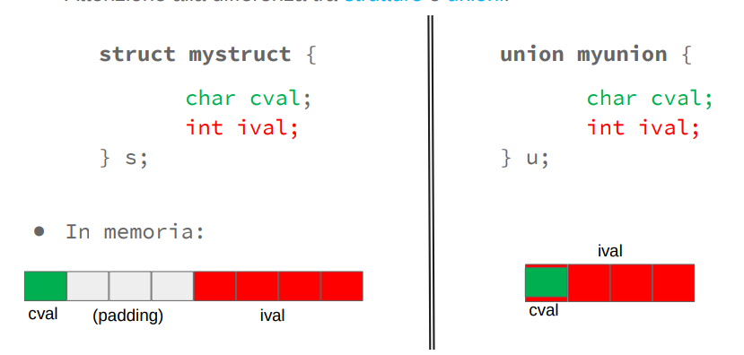

# Struct

Le strutture sono dette **aggregates**

Il nome di una struttura viene detta etichetta o structure tag

Se una struttura contiene un puntatore a se stessa viene detta **autoreferenziale**

Una definizione di struttura non riserva spazio nella memoria

Non si possono confrontare due strutture, perchè dipende dalla macchina per il quale viene compilata. Inoltre talvolta vengono aggiunti dei padding tra le variabili in maniera dipendente dall'inizializzazione.

### Inizializzatori

Se sono presenti meno inizializzatori rispetto ai membri, i membri rimanenti vengono
automaticamente inizializzati a 0 o NULL.
Ad esempio:

```c
struct card {
    const char *face;
    const char *suit;
    const char *test;
};

struct card myCard = {"Three", "Hearts"};
```

Le variabili struct definite all’esterno di una definizione di funzione (ovvero al top level)
vengono inizializzate a 0 o NULL se non sono inizializzate esplicitamente nella definizione.

```c
struct card myCard;

int main() {
    // Codice
}
```

**Questa inizializzazione viene fatta a compile-time così da risparmiare il codice dell'inizializzazione.**

## Accesso ai membri

- Struttura si usa la sintassi `myCard.face`
- Puntatore a struttura si usa la sintassi `cardPtr->face` che sarebbe l'equivalente `(*cardPtr).face`

**Non bisogna mettere spazi intorno a questi due operatori**

## Utilizzo di struct nelle funzioni

Nelle prime versioni di C si poteva solo passare e ritornare un puntatore a struct. Ora è possibile anche il passaggio per valore.

Nel passaggio di struct, il C segue il tipo definito nella struct. Ad esempio se nella struct c'è un array, nel passaggio di valore vengono copiate tutte le celle e non passate per referenza(o riferimento).

Si possono anche passare membri usando gli stessi operatori di una variabile(ad esempio derefenziamento).

# Typedef

Typedef consente di creare alias per tipi precedentemente definiti(come struct, enum, ...)

**typedef non crea nuovi tipi ma crea degli alias**

```c
typedef struct {
    const char *face;
    const char *suit;
} Card;
```

Notazione: Le strutture con typedef vanno messe in maiuscolo

è disponibile anche una sintassi dove si specifica prima la struct poi il typedef, questo nasce per mantenere la compatibilità

# Enum

Il `#define` ha il problema di non avere il type checking a compile time.

Per questo è stato inventato il costrutto `enum`.

L'enum definisce un insieme di costanti di enumerazione di interi.

```c
enum months { JAN, FEB, MAR, APR, MAY, JUN, JUL, AUG, SEP, OCT, NOV, DEC };
```

Se non specificiato i valori iniziano da 0.

```c
enum months { JAN=1, FEB, MAR, APR, MAY, JUN, JUL, AUG, SEP, OCT, NOV, DEC };
```

Così partono da 1

I nomi all'interno degli `enum` devono essere univoci(non possono esistere funzioni, variabili, ... con lo stesso nome)

Convenzione: I nome all'interno di un `enum` vanno maiuscoli.

Il typedef funziona anche per gli enum:

```c
typedef enum outcome { 
    OUTOFMEMORY = −1, 
    ALREADYPRESENT, 
    INSERTED 
} Outcome;
```

In generale è meglio evitare `#define` se possiamo usare `enum`

# Union

Le `union` sono tipi simili alle `struct` ma che può contenere un solo membro tra quelli specificati.

La sintassi è identica a quelle delle `struct`.

```c
union myunion {
    char cval;
    int ival;
    float fval;
} u;
```

La `union` `u` può contenere solo `cval`, `ival` o `fval` ma non contemporaneamente.

La memoria viene sovrapposta tra le variabili per salvare spazio.

La memoria occupata da una `union` è lo spazio massimo che occupa la variabile più grande. All'interno di quello spazio verranno messe le variabili che occupano meno spazio




Infatti quando ad un membro viene dato un valore, gli altri valori verranno sovrascritti:

```c
union myunion {
    char cval;
    int ival;
    float fval;
} u, *ptru;

u.cval = ’h’;
u.ival = 0xDE4D7E91; /* sostituisce cval! */

ptru = &u;
ptru->fval = 3.14; /* sostituisce ival! */

```

Notiamo che un membro di una `union` può essere una `struct` e viceversa.

Ad esempio quest'ultimo uso è utile per cambiare tipo di variabile in base ad una flag:

```c
struct {
    int flags;
    char *name;
    union {
        int ival;
        char *sval;
    } u;    // In base alla union accediamo a variabili diverse
} symtab[NSYM];
```

Alternativamente come flag per la `union` è consigliabile usare un `enum` al posto di un generico `int`:

```c
enum unionTag { IS_INT, IS_CHAR };

struct taggedUnion {
    enum unionTag tag;
    union {
        int i;
        char c;
    } data;
};
```

